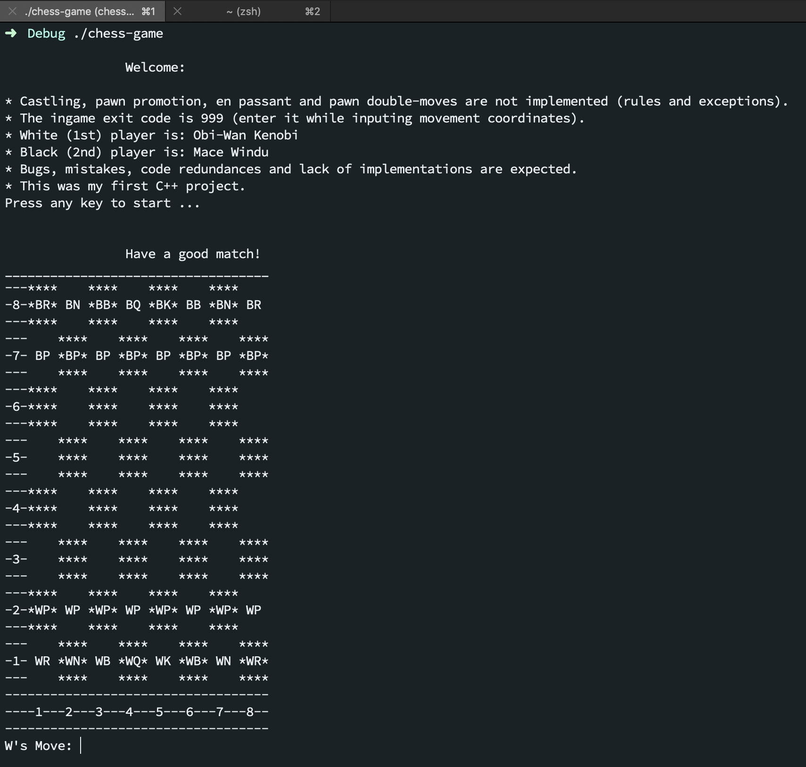
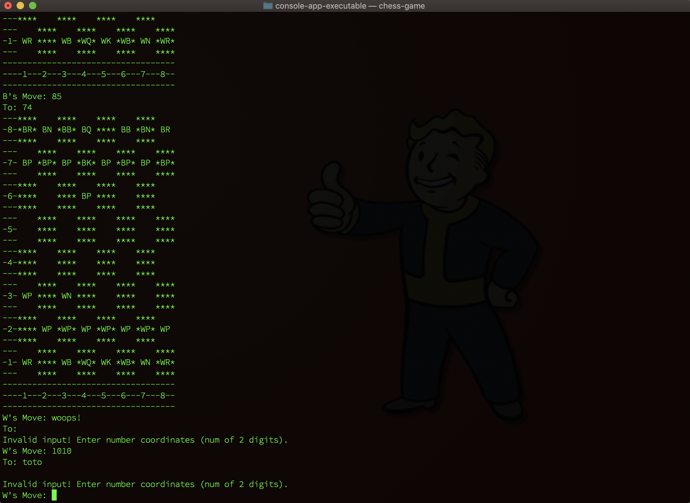
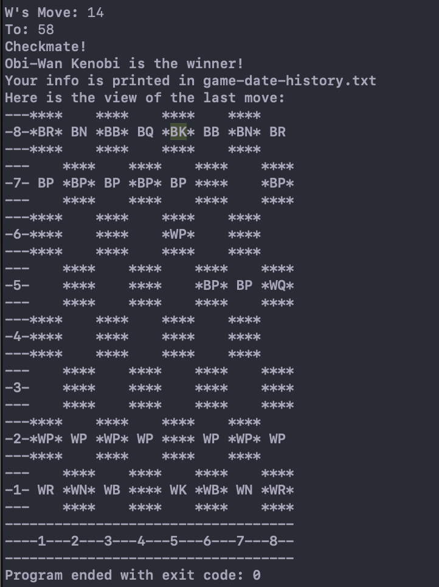

# Chess Game 🏁♟️
<h3>A second year university C++ game project.</h3>
I primarily found some base code on YouTube for this and then worked on top of that. It was made in Visual Studio IDE, but recently rediscovered and reviewed in Xcode.

#### Project snapshots:
<h6>View #1 &#x2198;</h6>
<kbd></kbd>
<h6>View #2 &#x2198;</h6>
<kbd></kbd>
<h6>View #3 &#x2198;</h6>
<kbd></kbd>

