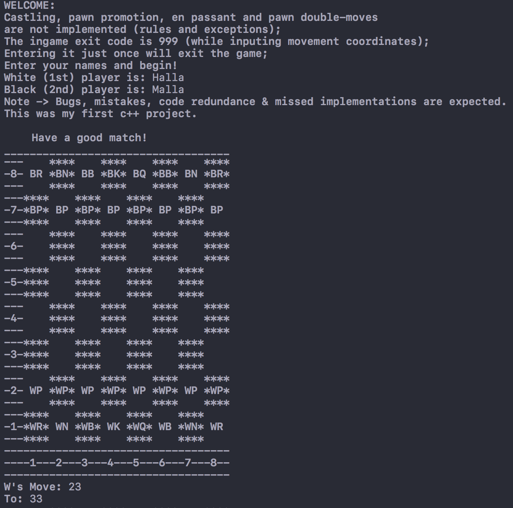
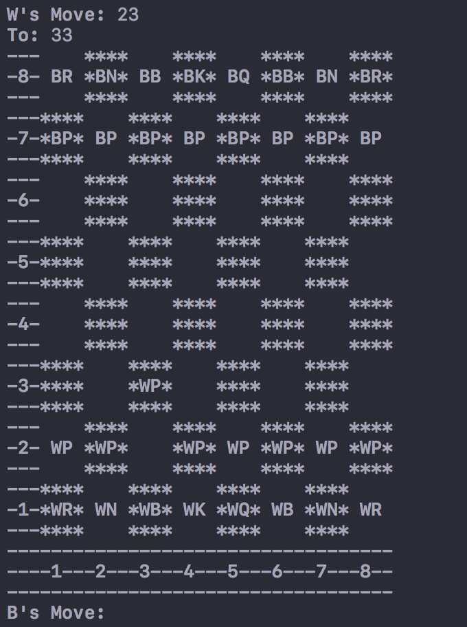

# chess-game 🏁
<h3>A second year university c++ game project. ♟️</h3>

I primarily found some base code on YouTube for this and then worked on top of that.

C++ is a powerful and an interesting language to work with. Although a bit harder, I liked tinkering with it when I had been writing this chess game. It was made in Visual Studio IDE, but recently was rediscovered and reviewed in Xcode.

I've included std namespace in header files. I know It's bad practice, but this is a small project and I didn't really thought about it back when I made it. 

#### Project snapshots:

View 1

View 2

