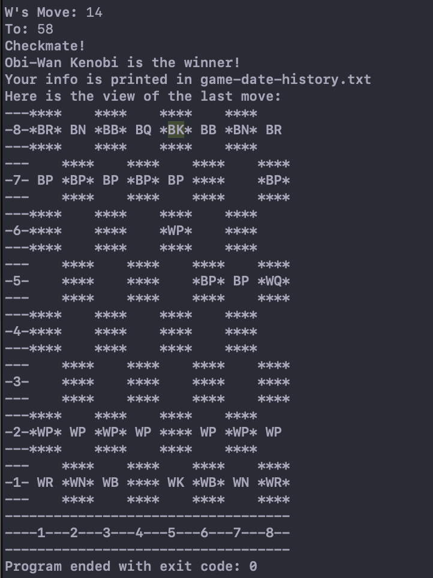

# chess-game 🏁
<h3>A second year university C++ game project. ♟️</h3>
I primarily found some base code on YouTube for this and then worked on top of that. It was made in Visual Studio IDE, but recently rediscovered and reviewed in Xcode.

#### Project snapshots:
<h6>View 1</h6>

<h6>View 2</h6>

<h6>View 3</h6>

